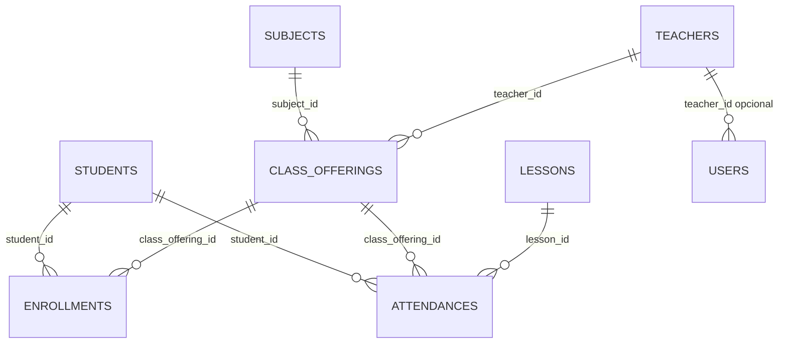

# Relationship

Mapa de relacionamento das entidades do projeto.



## Leitura das entidades

- `Subject` 1:N `ClassOffering`: uma disciplina pode ter várias ofertas/turmas.
- `Teacher` 1:N `ClassOffering`: um professor pode lecionar várias ofertas.
- `Student` N:N `ClassOffering` via `Enrollment`: matrícula é a tabela associativa, com `status`, `enrolledAt` e `canceledAt`.
- `Student` 1:N `Attendance`: um aluno pode ter vários registros de presença.
- `ClassOffering` 1:N `Attendance`: uma oferta/turma concentra vários registros de presença.
- `Lesson` é referenciada por `Attendance.lessonId`, mas não existe entidade/tabela `lessons` no projeto.
- `Teacher` 1:N `User`, opcional: `users.teacher_id` pode ser nulo. Como não há `unique`, o banco permite vários usuários para o mesmo professor.

## Observacao sobre foreign keys

No modelo de dominio, os relacionamentos aparecem pelos campos UUID (`subjectId`, `teacherId`, `studentId`, `classOfferingId` e `lessonId`). No schema Drizzle e nas migrations, quase todos esses campos estao modelados apenas como UUIDs obrigatorios, sem foreign key explicita.

A unica FK explicita atualmente e:

```sql
users.teacher_id -> teachers.id
```
